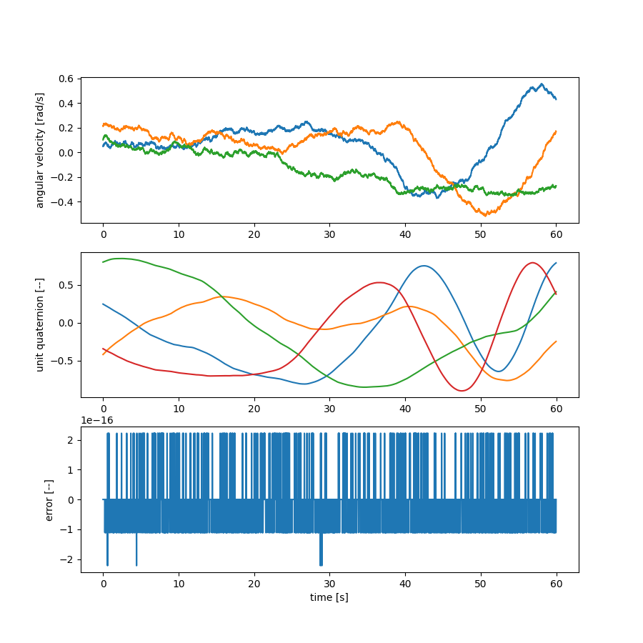

Attitude Dynamics
=================

Time history of attitude dynamics
---------------------------------

.. code-block:: python

  from openmdao.api import Problem, Group
  from openmdao.api import IndepVarComp
  from lsdo_cubesat.utils.random_arrays import make_random_bounded_array
  import matplotlib.pyplot as plt
  from lsdo_cubesat.attitude.new.attitude_rk4_gravity_comp import AttitudeRK4GravityComp
  import numpy as np
  import seaborn as sns
  
  np.random.seed(0)
  num_times = 6000
  step_size = 1e-2
  I = np.array([90, 100, 80])
  wq0 = np.array([-1, 0.2, 0.3, 0, 0, 0, 1])
  
  wq0 = np.random.rand(7) - 0.5
  wq0[3:] /= np.linalg.norm(wq0[3:])
  
  comp = IndepVarComp()
  comp.add_output('initial_angular_velocity_orientation', val=wq0)
  comp.add_output(
      'external_torques_x',
      val=make_random_bounded_array(num_times, bound=1).reshape((1, num_times)),
      shape=(1, num_times),
  )
  comp.add_output(
      'external_torques_y',
      val=make_random_bounded_array(num_times, bound=1).reshape((1, num_times)),
      shape=(1, num_times),
  )
  comp.add_output(
      'external_torques_z',
      val=make_random_bounded_array(num_times, bound=1).reshape((1, num_times)),
      shape=(1, num_times),
  )
  
  prob = Problem()
  prob.model.add_subsystem('inputs_comp', comp, promotes=['*'])
  prob.model.add_subsystem(
      'comp',
      AttitudeRK4GravityComp(
          num_times=num_times,
          step_size=step_size,
          moment_inertia_ratios=np.array([2.0 / 3.0, -2.0 / 3.0, 0]),
      ),
      promotes=['*'],
  )
  
  prob.setup(check=True, force_alloc_complex=True)
  prob.run_model()
  w = prob['angular_velocity_orientation'][:3, :]
  q = prob['angular_velocity_orientation'][3:, :]
  
  fig, ax = plt.subplots(3, 1, figsize=(9, 9))
  # fig, ax = plt.subplots(3, 1)
  t = np.arange(num_times) * step_size
  
  sns.lineplot(x=t, y=w[0, :], ax=ax[0])
  sns.lineplot(x=t, y=w[1, :], ax=ax[0])
  sns.lineplot(x=t, y=w[2, :], ax=ax[0])
  
  sns.lineplot(x=t[:-1], y=q[0, :-1], ax=ax[1])
  sns.lineplot(x=t[:-1], y=q[1, :-1], ax=ax[1])
  sns.lineplot(x=t[:-1], y=q[2, :-1], ax=ax[1])
  sns.lineplot(x=t[:-1], y=q[3, :-1], ax=ax[1])
  
  sns.lineplot(x=t[:-1], y=np.linalg.norm(q[:, :-1], axis=0) - 1, ax=ax[2])
  
  ax[2].set_xlabel('time [s]')
  ax[0].set_ylabel('angular velocity [rad/s]')
  ax[1].set_ylabel('unit quaternion [--]')
  ax[2].set_ylabel('error [--]')
  fig = plt.gcf()
  # fig.set_size_inches(9, 9)
  plt.show()
  

